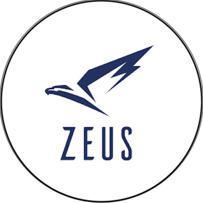

# Lane Detection Research | aUToronto 🚙  

## Introduction

The focus of this research project is to develop the lane detection capabilities of Zeus, the self driving car at aUToronto. As a member of the Perception Team at aUToronto I work to meet the milestone goals set by my team leads and the advising professors including but not limited to Prof. Angela Schoellig and Prof. Tim Barfoot from the University Of Toronto.

My task was to improve upon the results provided by the [GSCNN](https://github.com/nv-tlabs/GSCNN).

on the development of a complex hand gesture recognition system that can interface with a website, games and a robot all using the built-in webcam of a computer. In this currently on going project, I am responsible for researching contemporary machine learning approaches to achieving this goal, find an appropriate dataset and developing a model and train it to have a high performance accuracy. I am conducting the research work and development with a group of dedicated students in the University Of Toronto Machine Intelligence Student Team.

Currently we are developing the components needed for the final system in a modular fashion and will be integrating these parts by Feb-March of 2021. We aim to submit our insight and work at a conference! 

## Preliminary Results
